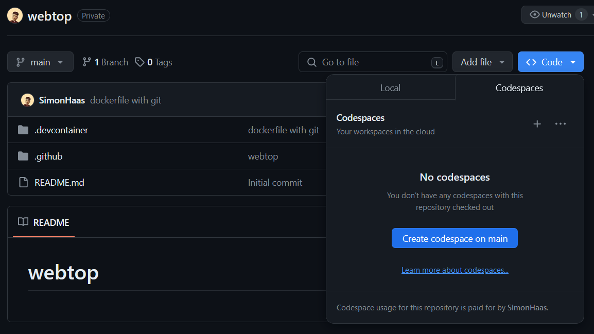
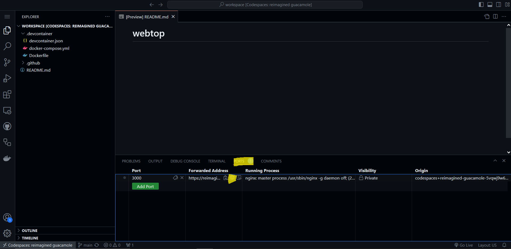
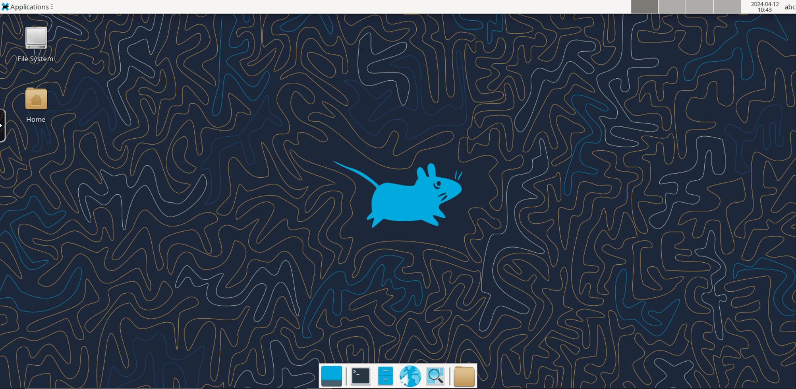

# webspace

[Codespaces](https://github.com/features/codespaces) + webtop = ❤

Get a remote session to a full linux desktop from within your current browser without installing any software on your current device.

Works everywhere:
- school
- university
- work

## How to start
1. Create a codespace 
2. Wait...
3. Click on "ports" and open webtop by clicking the globe symbol. 
4. Enjoy! 

## How it works

We use [Codespaces](https://github.com/features/codespaces) to get a virtual machine designed to run Visual Studio Code.
Then we use [webtop](https://docs.linuxserver.io/images/docker-webtop/) to start a docker container including a desktop environment and tools to make is accessible in the browser.

Take a look at the .devcontainer folder for details and feel free to modify it to your needs.

## Tailscale

You can you Tailscale to connect to other devices and networks.

``` shell
tailscale up --accept-routes
```

You'll only need to run `tailscale up` once per Codespace.
The Tailscale state will be saved between rebuilds.
